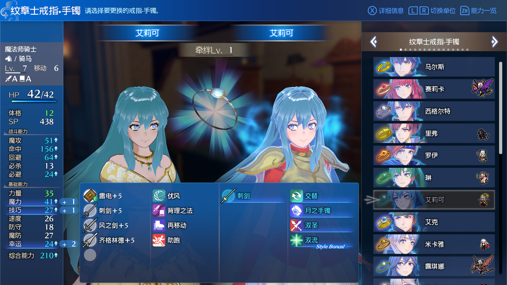

# Fire Emblem Engage — ZIP Audio and Emblem Equipment Rules

[简体中文](README.md)

Initial release: **[v0.1](https://github.com/haitei155/engage-zip-audio-equip-rules/releases/tag/v0.1)**.

**Install [Cobalt](https://github.com/Raytwo/Cobalt) first.** Thank you to **Raytwo** for developing and maintaining Cobalt and providing the mod-loading foundation used by this project.

The current binary targets Fire Emblem Engage 2.0.0 with Cobalt 1.31.0 as its compatibility baseline.

## Features

- Prepares verified SD cache files for BNK/WEM audio inside mod ZIPs and redirects native file reads; no manual character-audio extraction is required. After audio inside a ZIP is updated, the next full game launch automatically reads the new content, detects the change and prepares a verified new cache; manual cache clearing is unnecessary.
- Reads `patches/god_equip_restrictions/*.txt` supplied by mods to restrict playable characters from equipping their own same-name emblems.
- Supports configured paired-emblem and house-leader forms while retaining native equipment checks.
- Does not create missing recordings or forcibly unequip rings/bracelets already stored in a save.

## Same-Name Emblem Restriction Example

After configuring a custom added character's same-name emblem pair, that character cannot equip the corresponding emblem ring or bracelet. In this screenshot, the Eirika emblem entry is disabled for playable Eirika, while other entries remain selectable.



Future added characters are supported by supplying the corresponding PID/GID rules in their mod; the current implementation does not automatically compare display names. See [Equipment rule configuration](docs/CONFIGURATION.md). This screenshot illustrates equipment restrictions; ZIP audio caching is described separately above.

## Adding Rules for New Characters (No Source Changes)

With this plugin and the mods defining the corresponding person and emblem installed, add a rule file to introduce a new restriction. **No source modification or NRO rebuild is required.** Matching uses the actual PID/GID values, rather than character display names.

1. Create `patches/god_equip_restrictions/my_character.txt` at the character mod root. For a ZIP mod, the path inside the archive must also start with `patches/`.
2. Save it as UTF-8. Each line contains one person PID and one emblem GID, separated by spaces or tabs. This is the actual rule used by the current Shez package:

```text
# Playable Shez cannot equip emblem Shez
PID_MOD_SHEZ GID_Shez
```

For your own added character, use this template. `PID_MOD_MY_CHARACTER` and `GID_MY_EMBLEM` are placeholders; replace them with the exact, case-sensitive IDs in the person definitions (such as `Person.xml`) and emblem definitions (such as `God.xml`):

```text
PID_MOD_MY_CHARACTER GID_MY_EMBLEM
```

3. To block several corresponding forms for the same person, list each actual GID on its own line. Paired emblems and house-leader forms also require explicit entries; the plugin does not expand them by name.
4. Install the updated character mod, fully exit and restart the game, then check the disabled entry on the ring/bracelet selection screen. Rules are cached after their first read; returning to the title screen does not guarantee a reload.

Rules from all loaded mods are combined, so future characters can supply them in their own standalone packages. Blank lines and full-line `#` comments are ignored; do not append comments to pair lines. Native restrictions remain effective. These rules only add denied pairs: they do not define persons or emblems, or forcibly unequip rings/bracelets already stored in a save.

## Download and Installation

Current binary: [`engage_zip_audio_equip_rules.nro`](Releases/engage_zip_audio_equip_rules.nro); checksums: [SHA256SUMS](Releases/SHA256SUMS).

1. Install the prerequisite runtime using Cobalt's instructions.
2. Place the NRO in `engage/mods/engage-zip-audio-equip-rules/` and fully restart the game.
3. If the 12 Emblems integration package already contains this plugin, use that included copy and avoid installing another standalone copy.

Audio cache: `sd:/engage/.cache/wwise-zip-audio`. Cache identity includes the full audio path (including language), length and content. Existing cache bytes are checked on startup, and damaged or incomplete entries are rebuilt. ZIP replacement while the game is running does not trigger a live refresh. Fully restart the game after updating character audio. Rule syntax and examples: [Configuration](docs/CONFIGURATION.md).

## Source and Build

See [Build instructions](docs/BUILD.md). This snapshot includes the current implementation and the local dependencies used by it. New builds go to `dist/`, preserving the release binary in `Releases/`.

## License and Credits

Project-owned additions and documentation use the [Apache License 2.0](LICENSE). Third-party dependencies, upstream-derived code and resources retain their respective license terms and notices; see [THIRD_PARTY.md](THIRD_PARTY.md) and [NOTICE](NOTICE).

Thanks to [Raytwo](https://github.com/Raytwo/Cobalt), [DivineDragonFanClub](https://github.com/DivineDragonFanClub/engage-il2cpp), [skyline-rs](https://github.com/skyline-rs) and all relevant dependency contributors.
